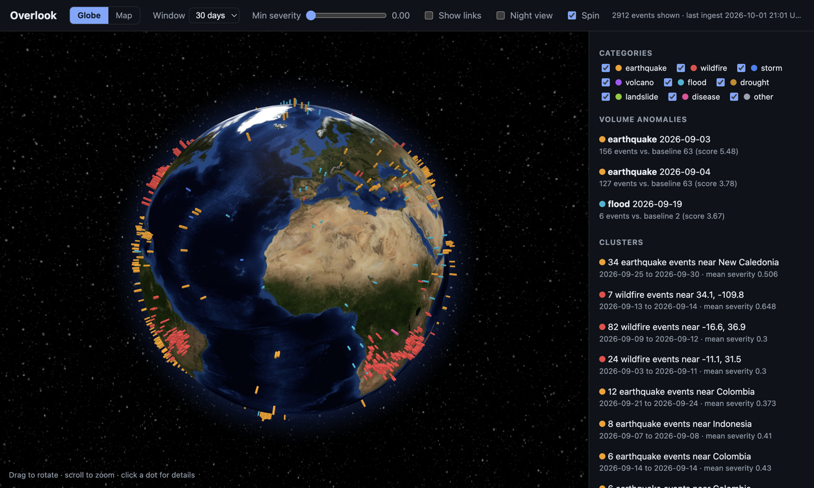
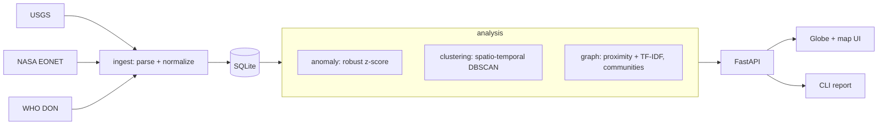

# Overlook

An open-source situational awareness tracker. It pulls public event feeds
(earthquakes, wildfires, storms, disease outbreaks) into one schema, then
answers three questions an analyst actually asks:

1. **Is something unusual happening?** Volume anomaly detection per category.
2. **What belongs together?** Spatio-temporal clustering (aftershock sequences, fire complexes).
3. **What is connected to what?** An event graph with communities and hotspots, linking events by proximity and by text similarity.

Everything is served through a small API and a browser UI with two views: a
3D globe (globe.gl on three.js) and a 2D Leaflet map.



> Independent personal project built on public data only.

## Quickstart

Requires Python 3.10+.

```bash
python3 -m venv .venv
.venv/bin/pip install -e ".[dev]"

.venv/bin/overlook ingest        # pull USGS, NASA EONET and WHO into data/overlook.db
.venv/bin/overlook report        # anomalies, clusters, hotspots in the terminal
.venv/bin/overlook serve         # globe/map UI + API at http://127.0.0.1:8000

.venv/bin/python -m pytest       # 43 tests, no network needed
```

The database path defaults to `data/overlook.db` (relative to where you run the
command). Override with `--db` or `OVERLOOK_DB`.

## Data sources

| Source | What | Auth | Notes |
|---|---|---|---|
| [USGS](https://earthquake.usgs.gov/earthquakes/feed/) | Earthquakes M2.5+ | none | Severity from magnitude |
| [NASA EONET](https://eonet.gsfc.nasa.gov/docs/v3) | Wildfires, storms, volcanoes, floods | none | Severity from fire acreage / wind speed where reported |
| [WHO DON](https://www.who.int/emergencies/disease-outbreak-news) | Disease outbreak notices | none | No coordinates; placed at the country centroid by parsing the title |

Adding a source means writing one module in `src/overlook/ingest/` with a pure
`parse(payload) -> list[Event]` and a thin `fetch(client, days)`.

## Architecture



Analysis runs on demand over the requested time window rather than being
precomputed; at a month of data (~2.5k events) each endpoint responded in under
0.1 s on a laptop (measured with curl on 2026-09-21). Revisit if the window or
event volume grows by an order of magnitude; the graph step is the first to slow
down, and is already capped at 300 nodes.

## API

| Endpoint | Purpose |
|---|---|
| `GET /api/status` | Event counts by source, last ingest time |
| `GET /api/events?days=&category=&min_severity=&limit=` | Normalized events |
| `GET /api/anomalies?days=` | Days where a category's volume is far above its baseline |
| `GET /api/clusters?days=&eps_km=&min_samples=` | Spatio-temporal clusters, ranked |
| `GET /api/graph?days=&max_nodes=` | Nodes, edges, communities, hotspots |

Interactive docs at `/docs` when the server is running.

## Example output

From a live run on 2026-09-21 (30-day window, 2,484 events):

```
Anomalies (daily volume vs. baseline)
  2026-09-10  wildfire     61 events (baseline 5, score 7.55)
  2026-09-03  earthquake  137 events (baseline 64, score 3.62)

Top clusters
   1.51  42 earthquake events near Indonesia  (2026-08-22 to 2026-08-28)
   1.31  79 wildfire events near -16.6, 36.9  (2026-09-09 to 2026-09-12)
   0.79  229 earthquake events near Alaska  (2026-09-01 to 2026-09-07)

Most connected events
   15.23  [earthquake] M 6.3 - 84 km SSW of Nikolski, Alaska
```

The Alaska cluster and the top graph hotspot are the same real event: an M6.3
mainshock and its aftershock sequence, found independently by two methods.

## Design notes

See [docs/design.md](docs/design.md) for requirements, algorithm choices, how the
clustering parameters were tuned on live data, and known limitations.

## Project layout

```
src/overlook/
  models.py       Event schema
  db.py           SQLite storage (upsert by id)
  geo.py          haversine, sphere projection, country lookup
  ingest/         one module per source + ingest_all()
  analysis/       anomaly.py, clustering.py, graph.py
  api.py          FastAPI app
  cli.py          ingest / report / serve
  static/         browser UI: 3D globe (globe.gl) and 2D Leaflet map views, one HTML file
tests/            parsers, geo, db, analysis, API
```

## Limitations

- Feeds are polled on demand (`overlook ingest`), not streamed. Run it on a schedule for a live view.
- WHO events sit at country centroids, so they show country-level location only.
- Severity is normalized within each source and is not comparable across categories; cluster ranking is a heuristic.
- EONET clusters are labeled with coordinates because EONET has no place names.
- The UI has only been checked in Chrome. The globe view needs WebGL; the map view does not.
